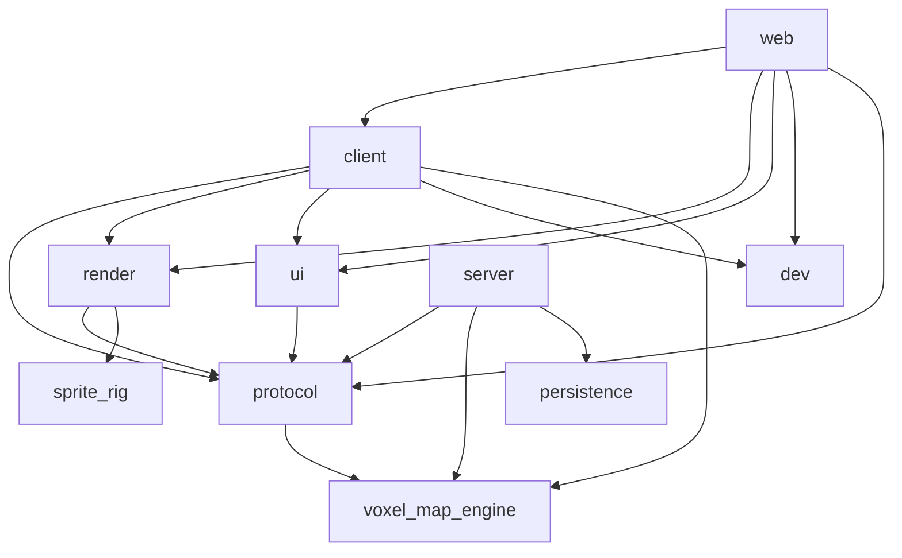

# Research Findings

## Q1: How is the lightyear client entity assembled in `crates/client/src/network.rs`?

**Direct answer:** `setup_client` (registered as a `Startup` system by `ClientNetworkPlugin`) spawns one entity with a fixed eight-component bundle, then inserts exactly one transport-IO component selected via `match` on `ClientTransport`. WASM is gated on the `Udp` arm only.

### Evidence

**Fixed base bundle** — `crates/client/src/network.rs:99-108`:
```rust
commands.spawn((
    Name::new("Client"),
    Client::default(),
    LocalAddr(config.client_addr),
    PeerAddr(config.server_addr),
    Link::new(None),
    ReplicationReceiver::default(),
    PredictionManager::default(),
    NetcodeClient::new(auth, netcode_config).unwrap(),
));
```

| Component | Value/source |
|---|---|
| `Name` | `"Client"` |
| `Client` | `Client::default()` |
| `LocalAddr` | `config.client_addr` — defaults to `0.0.0.0:0` |
| `PeerAddr` | `config.server_addr` — defaults to `127.0.0.1:5001` |
| `Link` | `Link::new(None)` (no conditioner) |
| `ReplicationReceiver` | `ReplicationReceiver::default()` |
| `PredictionManager` | `PredictionManager::default()` |
| `NetcodeClient` | from `Authentication::Manual` + `NetcodeConfig` |

**`ClientTransport` enum** — `crates/client/src/network.rs:14-22`:
```rust
pub enum ClientTransport {
    Udp,
    WebTransport { certificate_digest: String },
    Crossbeam(CrossbeamIo),
}
```

**Default impl** — `crates/client/src/network.rs:24-30`:
```rust
impl Default for ClientTransport {
    fn default() -> Self {
        Self::WebTransport {
            certificate_digest: CERTIFICATE_DIGEST.trim().to_string(),
        }
    }
}
```
where `CERTIFICATE_DIGEST` is `include_str!("../../../certificates/digest.txt")` at `network.rs:11`.

**Transport-component dispatch** — `crates/client/src/network.rs:111-126`:
```rust
match config.transport {
    #[cfg(not(target_family = "wasm"))]
    ClientTransport::Udp => {
        entity_builder.insert(UdpIo::default());
    }
    ClientTransport::WebTransport { certificate_digest } => {
        entity_builder.insert(WebTransportClientIo { certificate_digest });
    }
    ClientTransport::Crossbeam(crossbeam_io) => {
        entity_builder.insert(crossbeam_io);
    }
    #[cfg(target_family = "wasm")]
    ClientTransport::Udp => {
        panic!("UDP transport is not supported on WASM");
    }
}
```

**Crossbeam import** — `crates/client/src/network.rs:2`:
```rust
use lightyear::crossbeam::CrossbeamIo;
```

**Authentication construction** — `crates/client/src/network.rs:86-91`:
```rust
let auth = Authentication::Manual {
    server_addr: config.server_addr,
    client_id: config.client_id,
    private_key: Key::from(config.private_key),
    protocol_id: config.protocol_id,
};
```
`client_id: u64` defaults to `0`; `protocol_id` ← `protocol::PROTOCOL_ID` (`0u64`, `crates/protocol/src/lib.rs:55`); `private_key` ← `protocol::PRIVATE_KEY` (`[0u8; 32]`, `crates/protocol/src/lib.rs:56`).

**Netcode config** — `crates/client/src/network.rs:93-96`:
```rust
let netcode_config = NetcodeConfig {
    token_expire_secs: config.token_expire_secs,
    ..Default::default()
};
```
`token_expire_secs` defaults to `30` (`network.rs:54`).

**`ClientNetworkPlugin` build** — `crates/client/src/network.rs:72-82`:
```rust
impl Plugin for ClientNetworkPlugin {
    fn build(&self, app: &mut App) {
        let config = self.config.clone();
        app.insert_resource(config.clone());
        app.add_systems(Startup, move |commands: Commands| {
            setup_client(commands, config.clone());
        });
        app.add_observer(on_connected);
        app.add_observer(on_disconnected);
    }
}
```
Plugin adds: 1 resource (`ClientNetworkConfig`), 1 startup system, 2 observers (`on_connected`/`on_disconnected` log on `On<Add, Connected>` / `On<Add, Disconnected>` at `network.rs:129-135`). It does **not** add `ClientPlugins` — that is the binary's responsibility (e.g. `web/src/main.rs:26-28`).

**WASM gates** — exactly two in `network.rs`, both on `Udp` match arms (lines 112 and 122). `WebTransport` and `Crossbeam` arms have no `cfg` gates and compile on both targets.

---

## Q2: How does `start_server` spawn one entity per `ServerTransport` variant?

**Direct answer:** `start_server` iterates `config.transports: Vec<ServerTransport>`, matches each variant (`crates/server/src/network.rs:98-208`), spawns one entity per variant with a per-transport component bundle, then triggers `Start { entity }`. WebTransport identity is loaded synchronously via `IoTaskPool::scope` + `async_compat::Compat`. WebSocket uses `Identity::self_signed`. Crossbeam carries the `CrossbeamIo` in the variant. `ClientOf → ReplicationSender` is wired via `register_required_components_with` (no observer).

### Evidence

**`ServerTransport` enum** — `crates/server/src/network.rs:17-28`:
```rust
pub enum ServerTransport {
    Udp { port: u16 },
    WebTransport { port: u16 },
    WebSocket { port: u16 },
    Crossbeam {
        io: lightyear_crossbeam::CrossbeamIo,
    },
}
```

**UDP spawn** — `crates/server/src/network.rs:99-124`:
```rust
commands.spawn((
    Name::new("UDP Server"),
    Server::default(),
    NetcodeServer::new(server::NetcodeConfig {
        protocol_id: config.protocol_id,
        private_key: Key::from(config.private_key),
        ..default()
    }),
    LocalAddr(SocketAddr::from((config.bind_addr, port))),
    ServerUdpIo::default(),
))
```
(*Note: agent reports the type used is `ServerUdpIo::default()` here; agent Q4 reported zero occurrences of `ServerUdpIo` anywhere — flagged as a contradiction in Open Areas.*)

**Cert path constants** — `crates/server/src/network.rs:11-12`:
```rust
const CERT_PEM: &str = concat!(env!("CARGO_MANIFEST_DIR"), "/../../certificates/cert.pem");
const KEY_PEM: &str = concat!(env!("CARGO_MANIFEST_DIR"), "/../../certificates/key.pem");
```

**Async identity loader** — `crates/server/src/network.rs:80-91`:
```rust
fn load_webtransport_identity() -> lightyear::webtransport::prelude::Identity {
    IoTaskPool::get()
        .scope(|s| {
            s.spawn(Compat::new(async {
                lightyear::webtransport::prelude::Identity::load_pemfiles(CERT_PEM, KEY_PEM)
                    .await
                    .expect("Failed to load WebTransport certificates")
            }));
        })
        .pop()
        .unwrap()
}
```
`.scope()` blocks the current thread until the spawned task completes; `Compat::new` adapts a tokio-based future onto Bevy's `futures-lite` executor.

**WebTransport spawn** — `crates/server/src/network.rs:125-156`:
```rust
let wt_certificate = load_webtransport_identity();
let digest = wt_certificate.certificate_chain().as_slice()[0].hash();
info!("WebTransport certificate digest: {}", digest);

commands.spawn((
    Name::new("WebTransport Server"),
    Server::default(),
    NetcodeServer::new(server::NetcodeConfig { ... }),
    LocalAddr(SocketAddr::from((config.bind_addr, port))),
    WebTransportServerIo { certificate: wt_certificate },
))
```

**WebSocket spawn (self-signed at runtime)** — `crates/server/src/network.rs:157-191`:
```rust
let ws_config = lightyear::websocket::server::ServerConfig::builder()
    .with_bind_address(SocketAddr::from((config.bind_addr, port)))
    .with_identity(
        lightyear::websocket::server::Identity::self_signed(vec![
            "localhost".to_string(),
            "127.0.0.1".to_string(),
        ])
        .expect("Failed to generate WebSocket certificate"),
    );
commands.spawn((
    Name::new("WebSocket Server"),
    Server::default(),
    NetcodeServer::new(server::NetcodeConfig { ... }),
    LocalAddr(SocketAddr::from((config.bind_addr, port))),
    WebSocketServerIo { config: ws_config },
))
```
No `IoTaskPool` / `async-compat` involvement.

**Crossbeam spawn** — `crates/server/src/network.rs:192-207`:
```rust
ServerTransport::Crossbeam { io } => {
    let server = commands.spawn((
        Name::new("Crossbeam Server"),
        Server::default(),
        NetcodeServer::new(server::NetcodeConfig { ... }),
        io,
    )).id();
    commands.trigger(Start { entity: server });
    info!("Crossbeam server started for testing");
}
```
No explicit `LocalAddr`; `CrossbeamIo` itself `#[require]`s `LocalAddr(LOCALHOST)`/`PeerAddr(LOCALHOST)` (per the lightyear submodule).

**`ClientOf` → `ReplicationSender` wiring** — `crates/server/src/network.rs:70-72`:
```rust
app.register_required_components_with::<ClientOf, ReplicationSender>(|| {
    ReplicationSender::new(REPLICATION_INTERVAL, SendUpdatesMode::SinceLastAck, false)
});
```
where `REPLICATION_INTERVAL = 100ms` (`network.rs:13`). Bevy's required-component mechanism, not an observer.

**`ServerNetworkPlugin::build`** — `crates/server/src/network.rs:65-78`:
```rust
app.insert_resource(config.clone());
app.register_required_components_with::<ClientOf, ReplicationSender>(...);
app.add_systems(Startup, move |commands: Commands| {
    start_server(commands, config.clone());
});
```
No sub-plugins added; `ServerPlugins` is added separately in `main.rs:39-41`.

**`cfg` gates:** none in `network.rs`. Server crate's only feature is `tracy` (unrelated).

---

## Q3: How does `crates/web/src/network.rs` relate to `ClientNetworkPlugin`?

**Direct answer:** `WebClientPlugin` is a thin configuration wrapper that loads the cert digest under `cfg(target_family = "wasm")`, builds a fixed `ClientNetworkConfig` with `ClientTransport::WebTransport`, and adds `ClientNetworkPlugin { config }`. It depends on the `client` crate, re-exports its types, and adds no systems/resources/components of its own.

### Evidence

**Re-export** — `crates/web/src/network.rs:6`:
```rust
pub use client::network::{ClientNetworkConfig, ClientNetworkPlugin, ClientTransport};
```

**Cert digest selection** — `crates/web/src/network.rs:20-24`:
```rust
#[cfg(target_family = "wasm")]
let certificate_digest = include_str!("../../../certificates/digest.txt").to_string();

#[cfg(not(target_family = "wasm"))]
let certificate_digest = String::new();
```
On native, an **empty string** is passed. (Note: `client` crate has its own `CERTIFICATE_DIGEST` const loaded unconditionally at `crates/client/src/network.rs:11` and `.trim()`-ed in `Default`.)

**Config construction** — `crates/web/src/network.rs:27-35`:
```rust
let config = ClientNetworkConfig {
    client_addr: SocketAddr::from(([0, 0, 0, 0], 5001)),
    server_addr: SocketAddr::from(([127, 0, 0, 1], 5001)),
    client_id: 0,
    protocol_id: PROTOCOL_ID,
    private_key: PRIVATE_KEY,
    transport: ClientTransport::WebTransport { certificate_digest },
    ..default()
};
```
(*Note: `client_addr` port here is `5001` — the client crate's `Default` uses port `0`. That difference exists in the web crate.*)

**Plugin delegation** — `crates/web/src/network.rs:38`:
```rust
app.add_plugins(ClientNetworkPlugin { config });
```

**Dependency on `client`** — `crates/web/Cargo.toml:50`:
```toml
client = { path = "../client", default-features = false }
```

**Lightyear features in `web/Cargo.toml:39-48`:**
```toml
lightyear = { workspace = true, features = [
    "client",
    "netcode",
    "webtransport",
    "websocket",
    "leafwing",
    "prediction",
    "replication",
    "interpolation",
] }
```
Note: `web` lacks `"udp"` and `"crossbeam"`; client crate has both.

**WASM-only deps** — `crates/web/Cargo.toml:57-61`:
```toml
[target.'cfg(target_family = "wasm")'.dependencies]
wasm-bindgen = ...
console_error_panic_hook = ...
getrandom = ...
getrandom_02 = ...
```

**Effect of removing non-WebTransport variants from `client`:** `web` only references `ClientTransport::WebTransport`; removing `Udp`/`Crossbeam` from the enum would not change web's call sites. The web crate would no longer need the `cfg(target_family = "wasm")` guard around the digest if the underlying client always required a digest.

---

## Q4: Where are `ClientTransport`, `ServerTransport`, `UdpIo`, `ServerUdpIo`, `WebSocketServerIo`, `CrossbeamIo`, `lightyear_crossbeam`, and the `udp`/`websocket`/`crossbeam` features referenced outside the three `network.rs` files?

**Direct answer:** No `.rs` files outside the three `network.rs` files reference any of those *symbols*. References to the *crate* `lightyear_crossbeam` and the *features* live in `Cargo.toml` files and in `crates/server/tests/integration.rs`.

### Evidence — symbol grep

Across all committed `.rs` files outside the three excluded files:

| Symbol | Hits outside network.rs |
|---|---|
| `ClientTransport` | 0 |
| `ServerTransport` | 0 |
| `UdpIo` | 0 |
| `ServerUdpIo` | 0 |
| `WebSocketServerIo` | 0 |
| `CrossbeamIo` | uses in `crates/server/tests/integration.rs` — see below |
| `lightyear_crossbeam` | uses in `crates/server/tests/integration.rs` — see below |

**Integration test** — `crates/server/tests/integration.rs:45`:
```rust
let (crossbeam_client, crossbeam_server) = lightyear_crossbeam::CrossbeamIo::new_pair();
```
Also at lines 345, 469, 1142.

### Evidence — Cargo.toml feature flags (per-crate)

| Crate | lightyear features in `[dependencies]` |
|---|---|
| `protocol` | `avian3d`, `leafwing` |
| `client` | `client`, `netcode`, **`udp`**, **`crossbeam`**, **`webtransport`**, `leafwing`, `prediction`, `replication`, `interpolation` |
| `server` | `server`, `netcode`, **`udp`**, **`webtransport`**, **`websocket`**, `leafwing`, `replication`, **`crossbeam`** |
| `web` | `client`, `netcode`, **`webtransport`**, **`websocket`**, `leafwing`, `prediction`, `replication`, `interpolation` |
| `render` | `frame_interpolation` |
| `ui` | `client`, `netcode` |
| `dev` | (none) |
| `persistence` | (none) |

`lightyear_crossbeam` direct dep:
- `crates/server/Cargo.toml:22`: `lightyear_crossbeam = { workspace = true }`

Workspace `Cargo.toml:46-51`:
```toml
lightyear = { path = "git/lightyear/lightyear", features = [
  "leafwing",
  "raw_connection",
] }
lightyear_crossbeam = { path = "git/lightyear/lightyear_crossbeam" }
lightyear_replication = { path = "git/lightyear/lightyear_replication" }
```

### Evidence — non-Cargo.toml/non-Rust files

- `README.md` — no transport-symbol hits
- `Makefile.toml` — no transport-symbol or feature hits (it does generate certs; see Q6)
- `.cargo/config.toml` — no transport hits
- All committed `doc/*.md` files — no transport hits
- No `.github/` or CI YAML files exist in the repo

---

## Q5: How is `git/lightyear/` decomposed, and how do its examples set up WebTransport client/server?

**Direct answer:** `lightyear_link`, `lightyear_connection`, `lightyear_transport`, `lightyear_netcode`, `lightyear_webtransport` are standalone crates. `lightyear_client` / `lightyear_server` are **not** standalone — `ClientPlugins` / `ServerPlugins` are PluginGroups inside the umbrella `lightyear` crate (`lightyear/src/client.rs`, `lightyear/src/server.rs`). The canonical WebTransport setup lives in `examples/common/src/{client.rs,server.rs}`.

### Evidence per crate

**`lightyear_link`** — `lightyear_link/src/lib.rs`
- Components/types: `Link`, `LinkConditioner<T>`, `LinkStats`, marker components `Linking` / `Linked` / `Unlinked` (with `on_insert` hooks at lines 236–288), `LinkStart` and `Unlink` (EntityEvent), `LinkSystems` / `LinkReceiveSystems` SystemSets, `server::LinkOf`, `server::Server`
- Plugin: `LinkPlugin` (lib.rs:298) registers `apply_link_conditioner` in `PreUpdate`
- Features (`Cargo.toml:11-14`): `default = ["std"]`, `std = []`, `test_utils = []`

**`lightyear_connection`** — `lightyear_connection/src/lib.rs`
- Components: `Client`, `Connect`/`Disconnect` (EntityEvents), state markers `Connected`/`Connecting`/`Disconnected`/`Disconnecting`, `Start`/`Stop` (EntityEvents), `Starting`/`Started`/`Stopping`/`Stopped`, `ClientOf`, `is_headless_server` run condition
- Resource: `PeerMetadata: HashMap<PeerId, Entity>` (`client.rs:147`)
- Plugins: `ConnectionPlugin` (empty), `client::ConnectionPlugin` and `server::ConnectionPlugin`
- Features (`Cargo.toml:12-14`): `default = []`, `client = []`, `server = []`

**`lightyear_transport`** — `lightyear_transport/src/lib.rs`
- Types: `Channel` trait, `ChannelMode`, `ChannelSettings`, `ReliableSettings`, `Transport`, `AppChannelExt`, `ChannelRegistry`, `PriorityConfig`, `PriorityManager`
- `plugin` submodule contains `TransportSystems`/`TransportPlugin`
- Features: `default = ["std"]`, `std`, `client = ["lightyear_connection/client"]`, `server = ["lightyear_connection/server"]`, `metrics`, `trace`, `test_utils`

**`lightyear_netcode`** — `lightyear_netcode/src/lib.rs`
- Components: `NetcodeClient` (`#[require(Link, Client, Disconnected)]`, `client_plugin.rs:32`), `NetcodeServer` (`#[require(Server)]`, `server_plugin.rs:35`), `TokenUserData`
- Types: `ConnectToken`, `ConnectTokenBuilder`, `Authentication`, `Key`, `generate_key`, `NetcodeConfig`
- Plugins: `NetcodeClientPlugin`, `NetcodeServerPlugin`
- Constants: `PRIVATE_KEY_BYTES=32`, `USER_DATA_BYTES=256`, `CONNECT_TOKEN_BYTES=2048`, `MAX_PACKET_SIZE=1200`
- Features: `default = ["std", "client", "server"]`, `std`, `client = [...]`, `server = [...]`, `trace`

**`lightyear_webtransport`** — `lightyear_webtransport/src/lib.rs`
- Types: `WebTransportError`, `Identity` (re-export from `aeronet_webtransport::wtransport`, non-WASM)
- Components: `WebTransportClientIo { certificate_digest: String }` (`client.rs:32`, `#[require(Link)]`), `WebTransportServerIo { certificate: Identity }` (`server.rs:50`, `#[require(Server)]`)
- Plugins:
  - `WebTransportClientPlugin` (client.rs:12) — observes `LinkStart`, reads `PeerAddr`, builds `ClientConfig`, spawns `AeronetLinkOf(entity)` via `WebTransportClient::connect(...)`
  - `WebTransportServerPlugin` (server.rs:19) — adds `aeronet_webtransport::server::WebTransportServerPlugin`, observes `LinkStart`/`SessionRequest` (auto-accepts)/`Add<Session>`
- Features (`Cargo.toml:19-36`): `default = ["self-signed"]`, `client = [...]`, `server = [...]`, `self-signed`, `dangerous-configuration`

**`lightyear_client` / `lightyear_server`** — do not exist as standalone crates.
- `ClientPlugins` (`lightyear/src/client.rs:13`):
  ```rust
  pub struct ClientPlugins {
      pub tick_duration: Duration,
  }
  ```
  Adds (feature-gated): `lightyear_sync::client::ClientPlugin`, `SharedPlugins`, `[prediction]` `PredictionPlugin`, `[webtransport]` `WebTransportClientPlugin`, `[websocket]` `WebSocketClientPlugin`, `[steam]` `SteamClientPlugin`, `[netcode]` `NetcodeClientPlugin`, `[raw_connection]` `RawConnectionPlugin`, `[wasm]` `lightyear_web::WebKeepalivePlugin`.
- `ServerPlugins` (`lightyear/src/server.rs:33`) symmetrically adds the server-side plugins, including `[udp,!wasm]` `ServerUdpPlugin`, `[webtransport,!wasm]` `WebTransportServerPlugin`, `[websocket,!wasm]` `WebSocketServerPlugin`.

### WebTransport example composition

**Client entity** — `git/lightyear/examples/common/src/client.rs:51-97`:
```rust
entity_mut.insert((
    Client::default(),
    Link::new(settings.conditioner.clone()),
    LocalAddr(client_addr),
    PeerAddr(settings.server_addr),
    ReplicationReceiver::default(),
    PredictionManager::default(),
    Name::from("Client"),
));
add_netcode(&mut entity_mut)?;  // inserts NetcodeClient
entity_mut.insert(WebTransportClientIo { certificate_digest });
```
On native, `certificate_digest = ""` (no pinning). On WASM, sourced from `digest.txt` or `window.location().hash()` / `window.CERT_DIGEST`.

**Server entity** — `git/lightyear/examples/common/src/server.rs:96-163`:
```rust
add_netcode(&mut entity_mut);   // inserts NetcodeServer { protocol_id, private_key, ... }
let server_addr = SocketAddr::new(Ipv4Addr::UNSPECIFIED.into(), local_port);
entity_mut.insert((
    LocalAddr(server_addr),
    WebTransportServerIo {
        certificate: (&certificate).into(),
    },
));
```

**`Identity` loading branches** — `examples/common/src/server.rs:197-248`:
- `AutoSelfSigned(sans)` → `Identity::self_signed(sans).unwrap()`, prints SHA-256 digest to stdout
- `FromFile { cert, key }` → `IoTaskPool` task wrapped in `async_compat::Compat`, calls `Identity::load_pemfiles(cert_pem_path, private_key_pem_path).await.unwrap()`

### Examples directory inventory

Workspace `Cargo.toml` includes `"examples/*"`. Confirmed example dirs include `examples/common/` and `examples/simple_box/`. The workspace glob means any `Cargo.toml`-bearing subdirectory is a member; full enumeration was not produced. There is **no** dedicated "webtransport-only" example — WebTransport is one option in `ClientTransports`/`ServerTransports` enums in `examples/common`.

---

## Q6: WebTransport handshake end-to-end

**Direct answer:** `certificates/generate.sh` (and `Makefile.toml` `[tasks.generate-certs]` duplicating it inline) produces self-signed EC P-256 cert + key + SHA-256 fingerprint digest. The client `include_str!`s `digest.txt` at compile time. The server reads `cert.pem`/`key.pem` async via `IoTaskPool::scope` + `async_compat::Compat`. `Authentication::Manual` constructs a netcode connect token client-side using `protocol_id=0` and `private_key=[0u8;32]` — the same constants used by the server's `NetcodeServer`.

### Evidence

**Cert generation script** — `certificates/generate.sh:10-26`:
```bash
openssl req -x509 \
    -newkey ec \
    -pkeyopt ec_paramgen_curve:prime256v1 \
    -keyout key.pem \
    -out cert.pem \
    -days 14 \
    -nodes \
    -subj "/CN=localhost"

FINGERPRINT=$(openssl x509 -in cert.pem -noout -sha256 -fingerprint | \
    sed 's/^.*=//' | sed 's/://g')

echo -n "$FINGERPRINT" > digest.txt
```

**`Makefile.toml` task** — `Makefile.toml:37-68` (`[tasks.generate-certs]`) inlines the same script. `[tasks.setup]` calls `cargo make generate-certs`. `[tasks.ensure-certs]` (`Makefile.toml:83-96`) calls `bash certificates/generate.sh` directly when `digest.txt` is missing.

**Compile-time client digest** — `crates/client/src/network.rs:11`:
```rust
const CERTIFICATE_DIGEST: &str = include_str!("../../../certificates/digest.txt");
```
Used in `ClientTransport::default()` at `network.rs:27`: `certificate_digest: CERTIFICATE_DIGEST.trim().to_string()`.

**Web-crate digest (WASM-only)** — `crates/web/src/network.rs:21`:
```rust
#[cfg(target_family = "wasm")]
let certificate_digest = include_str!("../../../certificates/digest.txt").to_string();
```
No `.trim()` here.

**Server cert paths** — `crates/server/src/network.rs:11-12`:
```rust
const CERT_PEM: &str = concat!(env!("CARGO_MANIFEST_DIR"), "/../../certificates/cert.pem");
const KEY_PEM: &str = concat!(env!("CARGO_MANIFEST_DIR"), "/../../certificates/key.pem");
```

**Async load** — `crates/server/src/network.rs:80-91`:
```rust
fn load_webtransport_identity() -> lightyear::webtransport::prelude::Identity {
    IoTaskPool::get()
        .scope(|s| {
            s.spawn(Compat::new(async {
                lightyear::webtransport::prelude::Identity::load_pemfiles(CERT_PEM, KEY_PEM)
                    .await
                    .expect("Failed to load WebTransport certificates")
            }));
        })
        .pop()
        .unwrap()
}
```

**Identity attached to server entity** — `crates/server/src/network.rs:125-144`:
```rust
let wt_certificate = load_webtransport_identity();
let digest = wt_certificate.certificate_chain().as_slice()[0].hash();
info!("WebTransport certificate digest: {}", digest);
commands.spawn((..., WebTransportServerIo { certificate: wt_certificate }));
```

**Client-side `Authentication::Manual`** — `crates/client/src/network.rs:86-91`:
```rust
let auth = Authentication::Manual {
    server_addr: config.server_addr,
    client_id: config.client_id,
    private_key: Key::from(config.private_key),
    protocol_id: config.protocol_id,
};
```
`protocol_id = 0` (`PROTOCOL_ID` in `crates/protocol/src/lib.rs:55`), `private_key = [0u8; 32]` (`PRIVATE_KEY` in `crates/protocol/src/lib.rs:56`), `client_id = 0`.

**Server-side netcode** — `crates/server/src/network.rs:133-137` (and same in every variant arm):
```rust
NetcodeServer::new(server::NetcodeConfig {
    protocol_id: config.protocol_id,
    private_key: Key::from(config.private_key),
    ..default()
})
```
Same `PROTOCOL_ID` and `PRIVATE_KEY` constants — shared via `crates/protocol`.

**Address hardcoding:**
- Server default: `transports: vec![ServerTransport::WebTransport { port: 5001 }]`, `bind_addr: [0,0,0,0]` (`crates/server/src/network.rs:40-49`) → `LocalAddr = 0.0.0.0:5001`.
- Client default: `client_addr = 0.0.0.0:0`, `server_addr = 127.0.0.1:5001` (`crates/client/src/network.rs:47-56`).
- Web hardcodes `client_addr = 0.0.0.0:5001`, `server_addr = 127.0.0.1:5001` (`crates/web/src/network.rs:27-35`).
- No env-var or config-file reading anywhere.

---

## Q7: Tests touching connection setup; `protocol::test_utils` exports; crates enabling `test_utils`

**Direct answer:** Only `crates/server/tests/integration.rs` exercises connection setup, predominantly via `lightyear_crossbeam::CrossbeamIo::new_pair()` with a custom `CrossbeamTestStepper` harness (bypassing `ServerNetworkPlugin`). One UDP integration test exists. `protocol::test_utils` exports two helpers; the feature is enabled by `client`, `server`, `ui` (dev-deps).

### Evidence

**`protocol::test_utils` feature definition** — `crates/protocol/Cargo.toml:7`:
```toml
[features]
test_utils = []
```
No transitive feature pulls.

**Module gate** — `crates/protocol/src/lib.rs:281-282`:
```rust
#[cfg(feature = "test_utils")]
pub mod test_utils;
```

**Public fixtures**:
| Symbol | Signature |
|---|---|
| `test_protocol_plugin` | `pub fn test_protocol_plugin() -> crate::ProtocolPlugin` |
| `assert_message_registered` | `pub fn assert_message_registered<M: Message>(app: &App)` |

Bodies:
```rust
pub fn test_protocol_plugin() -> crate::ProtocolPlugin { crate::ProtocolPlugin }
pub fn assert_message_registered<M: Message>(app: &App) {
    assert!(app.is_message_registered::<M>(), "Message {} not registered", std::any::type_name::<M>());
}
```

**Feature-gated message** — `crates/protocol/src/lib.rs:82-86`:
```rust
#[cfg(feature = "test_utils")]
#[derive(Serialize, Deserialize, Debug, PartialEq, Clone, Reflect, Event)]
pub struct TestTrigger { pub data: String }
```
Registered at `lib.rs:152-154`.

**Crates enabling `protocol/test_utils` (dev-deps)**:
- `crates/server/Cargo.toml:39`: `protocol = { workspace = true, features = ["test_utils"] }`
- `crates/client/Cargo.toml:28`: `protocol = { workspace = true, features = ["test_utils"] }`
- `crates/ui/Cargo.toml:12`: `protocol = { workspace = true, features = ["test_utils"] }`

`crates/web/Cargo.toml:64` also lists `protocol = { workspace = true, features = ["test_utils"] }`.

`server/Cargo.toml` dev-deps additionally include `client = { path = "../client" }` and `ui = { path = "../ui" }` — required by the integration test.

### Test file inventory

| File | Tests touching networking |
|---|---|
| `crates/server/tests/integration.rs` | All 13+ tests (one UDP, the rest crossbeam) |
| `crates/server/src/persistence/mod.rs` | inline `#[cfg(test)] mod tests` — none touch networking (FS persistence only) |

No `#[test]` blocks in `crates/client/src/**`, `crates/protocol/src/**` (outside `test_utils.rs`), or `crates/persistence/src/**`. No `crates/client/tests/` integration test files.

### Integration test highlights — `crates/server/tests/integration.rs`

**`#[test]`s** (selected): `test_client_server_udp_connection` (line 238, real UDP), `test_client_server_plugin_initialization` (342, crossbeam), `test_plugin_transport_configuration` (415), `test_crossbeam_reconnection` (450), `test_crossbeam_connection_establishment` (597), `test_crossbeam_client_to_server_messages` (642), `test_crossbeam_server_to_client_messages` (711), `test_crossbeam_event_triggers` (779, requires `test_utils`), `map_switch_request_triggers_transition_start` (937), `duplicate_switch_request_ignored` (1051), `server_and_client_spawn_matching_homebase_configs` (1138), `test_voxel_edit_ack_received` (1382), `test_server_pushes_chunks_without_request` (1518), `test_server_sends_unload_column_when_out_of_range` (1639).

**`CrossbeamTestStepper`** — `integration.rs:32-182` builds a manual harness without going through `ServerNetworkPlugin` / `ClientNetworkPlugin`:

```rust
let (crossbeam_client, crossbeam_server) = lightyear_crossbeam::CrossbeamIo::new_pair();
```
Server entity (line 73-81):
```rust
server_app.world_mut().spawn((
    Name::new("Test Server"), Server::default(),
    RawServer, DeltaManager::default(),
    crossbeam_server.clone(),
))
```
Client entity (line 85-100):
```rust
client_app.world_mut().spawn((
    Name::new("Test Client"), Client::default(),
    PingManager::new(PingConfig { ping_interval: Duration::ZERO }),
    ReplicationSender::default(), ReplicationReceiver::default(),
    crossbeam_client.clone(), PredictionManager::default(),
    RawClient,
    Linked,  // CRITICAL: Crossbeam needs explicit Linked
))
```
`ClientOf` proxy (line 103-120):
```rust
server_app.world_mut().spawn((
    Name::new("Test ClientOf"),
    LinkOf { server: server_entity },
    PingManager::new(...),
    ReplicationSender::default(), ReplicationReceiver::default(),
    Link::new(None),
    PeerAddr(SocketAddr::from(([127, 0, 0, 1], 9999))),
    Linked,
    crossbeam_server,
))
```
`wait_for_connection` (line 167-181): polls up to 50 ticks for `Connected` on the client.

Helper resources `MessageBuffer<M>` / `EventBuffer<E>` (185-234) accumulate received messages/events for assertions.

---

## Q8: Inter-crate dependency graph and constraints

**Direct answer:** `web` is the WASM-side root depending on `client + protocol + render + ui + dev`; `server` is independent of `client` (except via dev-deps); `client` depends on `protocol/render/ui/dev/voxel_map_engine`; `protocol` depends only on `voxel_map_engine`. `ui` depends on `protocol` directly via `path` (not `workspace = true`). No cycles. `lightyear_crossbeam` is a direct production dep of `server` only.

### Evidence

**Workspace lightyear deps** — root `Cargo.toml:46-51`:
```toml
lightyear = { path = "git/lightyear/lightyear", features = ["leafwing", "raw_connection"] }
lightyear_crossbeam = { path = "git/lightyear/lightyear_crossbeam" }
lightyear_replication = { path = "git/lightyear/lightyear_replication" }
```

**Per-crate workspace-internal deps:**

| Crate | Internal `[dependencies]` | Internal `[dev-dependencies]` |
|---|---|---|
| `protocol` | `voxel_map_engine` | (none) |
| `client` | `voxel_map_engine`, `protocol`, `render`, `ui`, `dev` | `protocol[test_utils]` |
| `server` | `voxel_map_engine`, `protocol`, `persistence` | `protocol[test_utils]`, `client`, `ui` |
| `web` | `protocol`, `client(default-features=false)`, `render`, `ui`, `dev`, `avian3d` | `protocol[test_utils]` |
| `render` | `protocol`, `sprite_rig` | (none) |
| `ui` | `protocol` (via `path = "../protocol"`) | `protocol[test_utils]` |
| `dev` | (none) | (none) |
| `persistence` | (none) | (none) |

**Per-crate lightyear features:**

| Crate | lightyear features |
|---|---|
| `protocol` | `avian3d`, `leafwing` |
| `client` | `client`, `netcode`, `udp`, `crossbeam`, `webtransport`, `leafwing`, `prediction`, `replication`, `interpolation` |
| `server` | `server`, `netcode`, `udp`, `webtransport`, `websocket`, `leafwing`, `replication`, `crossbeam` |
| `web` | `client`, `netcode`, `webtransport`, `websocket`, `leafwing`, `prediction`, `replication`, `interpolation` |
| `render` | `frame_interpolation` |
| `ui` | `client`, `netcode` |

`lightyear_crossbeam` direct deps:
- `crates/server/Cargo.toml:22`: `lightyear_crossbeam = { workspace = true }`

`lightyear_replication` direct deps:
- `crates/protocol/Cargo.toml:25` (dev-dep): `lightyear_replication = { workspace = true }`

**Per-crate `[features]`:**

| Crate | Features |
|---|---|
| `protocol` | `test_utils = []` |
| `client` | `default = ["file_watcher"]`, `file_watcher = ["bevy/file_watcher"]`, `tracy = ["bevy/trace_tracy", "tracy-client/enable"]` |
| `server` | `tracy = ["bevy/trace_tracy", "voxel_map_engine/tracy", "tracy-client/enable"]` |
| `web` | (none) |
| `render` | (none) |
| `ui` | (none) |
| `dev` | (none) |
| `persistence` | (none) |

**`[target.'cfg(...)'.dependencies]`:**
- Only `crates/web/Cargo.toml:57-61` — `[target.'cfg(target_family = "wasm")'.dependencies]` for `wasm-bindgen`, `console_error_panic_hook`, `getrandom`, `getrandom_02`.
- `crates/web/Cargo.toml:67-68` — `[target.'cfg(target_arch = "wasm32")'.dev-dependencies]` for `wasm-bindgen-test`, `console_error_panic_hook`.

### Production graph (Mermaid)



`dev`, `persistence` are leaves. No cycles. `server` has no production dep on `client`/`ui`/`render`/`web`; only dev-dep on `client` and `ui`.

---

## Cross-Cutting Observations

- **Three transport-IO surface areas exist in user code today:** the `ClientTransport` enum in `crates/client/src/network.rs` (Udp/WebTransport/Crossbeam), the `ServerTransport` enum in `crates/server/src/network.rs` (Udp/WebTransport/WebSocket/Crossbeam), and the unconditional `WebTransport` selection in `crates/web/src/network.rs`. The web crate consumes only the `WebTransport` variant.

- **WASM gating is narrow:** only two `cfg(target_family = "wasm")` sites exist in the three networking files — both on `Udp` arms in `crates/client/src/network.rs:112` and `:122`. The web crate's only WASM gate guards the cert-digest `include_str!`.

- **Shared netcode constants:** `protocol_id = 0` and `private_key = [0u8; 32]` come from `crates/protocol/src/lib.rs:55-56` and are used identically by client and server netcode constructors. `client_id` defaults to `0`. Tokens use `Authentication::Manual`.

- **Cert pipeline is a single source of truth:** `certificates/generate.sh` produces `cert.pem` / `key.pem` / `digest.txt`. The digest is `include_str!`'d into the binary at compile time on both `client` and `web` crates. The PEM files are loaded async (via `IoTaskPool::scope` + `async_compat::Compat`) by the server.

- **Replication wiring uses `register_required_components_with`:** server-side `ClientOf` → `ReplicationSender` is set up via Bevy's required-component hook, not an observer. (`crates/server/src/network.rs:70-72`)

- **Plugins are thin configurators, not wholesale subsystems:** `ClientNetworkPlugin` adds 1 resource + 1 startup system + 2 observers. `ServerNetworkPlugin` adds 1 resource + 1 required-component registration + 1 startup system. `WebClientPlugin` only constructs config and delegates. The lightyear plugin groups (`ClientPlugins`/`ServerPlugins`) are added by the binary, not by these wrapper plugins.

- **Lightyear crate decomposition hints at carving paths:** `lightyear_link`, `lightyear_connection`, `lightyear_transport`, `lightyear_netcode`, `lightyear_webtransport` are independent crates with `client`/`server`/`std`/`test_utils`/`self-signed` feature flags. `lightyear_client`/`lightyear_server` are *not* crates — they are `ClientPlugins`/`ServerPlugins` PluginGroups in the umbrella `lightyear` crate.

- **Test harness does not exercise `ServerNetworkPlugin`:** `crates/server/tests/integration.rs::CrossbeamTestStepper` constructs server/client entities by hand using `RawServer`/`RawClient`/`Linked` markers and `lightyear_crossbeam::CrossbeamIo::new_pair()`. It bypasses the plugin layer entirely. Only `test_client_server_udp_connection` uses the production plugin path.

- **`udp` and `crossbeam` lightyear features are in `client`'s Cargo.toml even though the only crossbeam usage in `client/src/network.rs` is the `ClientTransport::Crossbeam` enum variant.** Removing those variants would also drop the need for the `udp` and `crossbeam` features in `client/Cargo.toml`.

- **`lightyear_crossbeam` is a direct dep of `server` only** (alongside the umbrella `lightyear` `crossbeam` feature). `client` accesses `CrossbeamIo` via `lightyear::crossbeam::CrossbeamIo` (re-export through the umbrella).

---

## Open Areas

- **`UdpIo` vs `ServerUdpIo` discrepancy.** Q2 reported the UDP server bundle uses `ServerUdpIo::default()` at `crates/server/src/network.rs:99-124`, but Q4 reported zero hits for `ServerUdpIo` anywhere in the committed codebase. One of the agents may have misquoted the type name. The actual identifier (`UdpIo` vs `ServerUdpIo`) needs to be confirmed by direct inspection of `crates/server/src/network.rs`.

- **Examples enumeration.** `git/lightyear/Cargo.toml` includes `"examples/*"` as a glob. Only `examples/common/` and `examples/simple_box/` were confirmed by the agent; full directory listing was not produced.

- **`lightyear_replication` indirect surface area.** `protocol` has it as a dev-dep, and many lightyear features pull in replication transitively, but the exact set of types from `lightyear_replication` consumed by user code (e.g., `ReplicationReceiver`, `ReplicationSender`, `DeltaManager`) was not separately enumerated.

- **`web` crate's `client` dep with `default-features = false`.** `client`'s default feature is `file_watcher = ["bevy/file_watcher"]`. Web disables it but no other consequences were traced.

- **Whether the `client_addr` port mismatch matters.** `crates/web/src/network.rs:28` uses port `5001` for `client_addr`; `crates/client/src/network.rs:48` defaults to port `0`. Not investigated for runtime impact.

- **Self-signed WebSocket identity at runtime.** `crates/server/src/network.rs:160-170` calls `lightyear::websocket::server::Identity::self_signed(...)` synchronously without `IoTaskPool` — internal blocking I/O behavior was not investigated.

- **CI / scripts beyond `Makefile.toml` and `certificates/generate.sh`.** No `.github/`, no other scripts were found; `Cargo.toml` files are not in `git ls-tree HEAD` output (initially appeared unreadable to one agent due to a virtiofs quirk). Cargo.toml content was successfully read in subsequent passes.
