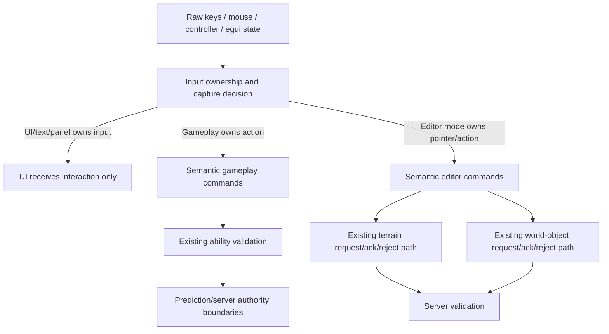

# refactor: Input Command Architecture

## Overview

Refactor non-movement input so UI, dev tools, terrain/world editing, and abilities stop competing for the same raw keys and mouse buttons. The implementation should add an explicit input ownership decision, translate allowed physical/UI interactions into semantic commands, and keep existing gameplay/server validation paths authoritative (see origin: `docs/brainstorms/2026-05-16-input-command-architecture-requirements.md`).

This is an infrastructure refactor, not a feature pass. It supports the vision by making Combat, Stage Editing, Home-Base editing, and Overworld admin tooling safer to evolve without adding new modes or gameplay behavior.

---

## Problem Frame

`PlayerActions` currently mixes movement, camera yaw, jump, voxel editing, and ability slots. Several systems then poll `ActionState<PlayerActions>` or raw `ButtonInput<KeyCode>` independently, so `Digit1`, mouse clicks, or `Delete` can be interpreted by whichever system happens to run and pass local gates. Egui pointer capture exists only in terrain brush input, and keyboard/text capture is not centralized.

The desired architecture prevents conflicts by construction: first decide who owns keyboard, pointer, and controller-style actions; then emit domain commands only for the owner; finally let gameplay/editor systems validate and execute those commands. Pointer ownership should be gesture-latched from press/drag start through release/cancel, not recalculated solely from hover every frame.

---

## Requirements Trace

- R1. One explicit input ownership decision exists before gameplay/editor commands are emitted for keyboard, pointer, and controller-style actions.
- R2. UI/text/panel capture suppresses gameplay/editor command emission for captured input while preserving normal UI interaction.
- R3. Gameplay, terrain brush, world-object placement, world-object selection/editing, and dev inspector interactions declare ownership explicitly.
- R4. Existing UI command sources, hotkeys, and future controller producers emit the same semantic command for the same player intent; this plan does not add production ability UI or new controller UX.
- R5. World editing consumes semantic editor commands instead of independently reading generic placement/removal actions.
- R6. Gameplay-changing commands preserve existing client prediction and server authority boundaries.
- R7. Ability activation consumes ability-slot or ability-intent commands instead of polling physical/input-action state inside activation logic.
- R8. Existing ability validation remains gameplay-owned: cooldowns, grounded requirements, duplicate active ability prevention, and slot/ability lookup.
- R9. Ability data no longer stores concrete physical or low-level input enum values for runtime triggers.
- R10. Immediate-mode UI renders state and emits commands/requests; it does not directly perform gameplay/world mutation.
- R11. Dev inspector toggles and panels use the same capture/routing principles as gameplay-facing UI.
- R12. Expected command rejection or suppression is traceable with explicit reasons.

**Origin actors:** A1 Player, A2 Dev/editor user, A3 Gameplay systems, A4 UI systems, A5 Networking/prediction systems
**Origin flows:** F1 Ability activation through gameplay focus, F2 Text or panel focus suppresses gameplay intent, F3 World editing through semantic commands
**Origin acceptance examples:** AE1 covers UI text capture suppressing ability activation, AE2 covers shared ability activation validation, AE3 covers terrain brush ownership, AE4 covers semantic ability/domain triggers

---

## Scope Boundaries

- Do not add new gameplay features.
- Do not add save/load input settings.
- Do not implement production ability UI controls, item hotbars, macros, radial menus, drag/drop hotbar editing, tooltips, cooldown UI, new controller bindings, or controller-specific UX.
- Do not replace all movement/camera input architecture unless needed to define command-routing boundaries.
- Do not weaken server authority for world edits or ability execution.
- Do not make UI the owner of gameplay state; UI remains a state projection and command source.
- Do not turn `PlayerActions` into a larger universal domain-command enum.
- Do not accidentally promote dev/admin world-editing tools into normal overworld player tools.

---

## Context & Research

### Relevant Code and Patterns

- `crates/protocol/src/lib.rs` defines `PlayerActions::{Move, CameraYaw, Jump, PlaceVoxel, RemoveVoxel, Ability1..Ability4}`.
- `crates/client/src/gameplay.rs` binds WASD/gamepad movement, mouse voxel actions, and `Digit1`-`Digit4` ability inputs into `InputMap<PlayerActions>`.
- `crates/protocol/src/ability/activation.rs` maps `PlayerActions` to ability slots and performs the validation to preserve: slot lookup, ability asset lookup, cooldown checks, duplicate active ability prevention, and grounded/airborne conditional effects.
- `crates/protocol/src/ability/effects.rs` polls caster `ActionState<PlayerActions>` for active-phase `OnInputEffects`.
- `crates/protocol/src/ability/types.rs` stores concrete `PlayerActions` in `EffectTrigger::OnInput` and `InputEffect`.
- `crates/client/src/map.rs` reads `PlaceVoxel`, `RemoveVoxel`, and raw `Delete` for terrain brush, voxel edit, world-object pick/place/move/delete/rotate flows. It already uses many `trace!` early-outs and has terrain-only egui pointer suppression.
- `crates/dev/src/state.rs` already has `EditingMode::{Terrain, PlaceDefinition, PlaceFreeForm, SelectEdit}` as a useful ownership seam.
- `crates/dev/src/lib.rs` and `crates/dev/src/panels/spawn.rs` read raw function keys / mutate panel request flags directly.
- Server-authoritative boundaries already exist for terrain and world objects in `crates/protocol/src/map/voxel.rs`, `crates/protocol/src/world_object/types.rs`, and handlers in `crates/server/src/map.rs`.
- Ability regression coverage lives primarily in `crates/protocol/tests/ability_systems.rs`; world-object UI/server coverage lives in `crates/client/tests/plugin.rs`, `crates/server/tests/world_object_placement.rs`, and `crates/server/tests/world_object_edit.rs`.

### Institutional Learnings

- `docs/solutions/` does not exist in this repo.
- Project memory `core/project/input-command-architecture.md`: central capture/context stack, semantic intents, ability validation preservation, and dev/world editing as explicit interaction modes are the preferred direction.
- Project memory `core/project/terrain-sculpting.md`: server remains authoritative; client prediction is visual responsiveness only; rejects roll back whole predictions; egui pointer suppression already matters for brush input.
- `docs/tasks/2026-05-15-terrain-sculpting-brushes/design.md`: terrain tools should route through explicit editing mode and not compete with object placement/selection modes.

### External References

- Not used. The repo already has direct local patterns for Bevy ECS events/resources, Lightyear request/ack boundaries, ability validation, and terrain/world-object authority. External research would add little practical value for this architecture plan.

---

## Key Technical Decisions

**Terminology:** ability command/intent refers to the semantic request to activate or observe an ability-domain input. Ability intent snapshot refers to the fixed-tick, per-caster read-only state that consumers observe. Editor command refers to client/dev-local terrain or world-object mutation intent before it becomes an existing network request.

- Add a small ownership/capture layer in the client/dev input boundary, not inside each gameplay system. This satisfies R1/R2 and avoids more per-system patches.
- Keep physical/networked inputs separate from domain commands. Movement/camera and Lightyear-compatible low-level inputs may continue using `PlayerActions`, but the plan must explicitly decide which captured UI/editor states suppress movement, jump, and camera yaw so text/pointer capture does not leak gameplay input unexpectedly.
- Use protocol-owned semantic ability intent types only where ability systems need to consume them in shared simulation code. Ability intents must be transported through a Lightyear-compatible fixed-tick path or produced from replicated/buffered low-level input on both client and server; plain client-local events are not sufficient for authority or prediction parity.
- Keep client/dev editor commands out of `protocol` unless they are actual network contracts. Editor commands should live in client/dev code and translate into the existing authoritative terrain/world-object request messages.
- Treat semantic ability intents as read-only per-caster/per-tick observations rather than destructively consumed events, so activation and active-phase input effects can observe the same tick without ordering bugs.
- Migrate ability input triggers to an ability-domain trigger type rather than storing `PlayerActions` in assets.
- Keep `EditingMode` as the first-class editor ownership selector, but never let its default value alone capture gameplay input. Editor ownership also requires the relevant dev inspector/panel/tool activation.
- Distinguish open panels from captured input: pointer-over/wants-pointer suppresses pointer commands, focused text/wants-keyboard suppresses keyboard gameplay/editor commands, and a merely open panel does not globally capture all input.
- Route dev hotkeys through the client-owned ownership layer unless a specific debug toggle is deliberately documented as a global override; avoid adding any `dev` -> `client` dependency.
- Every intentional suppression path should emit `trace!` with the owner/reason, matching project rules against silent early-outs.

---

## Open Questions

### Resolved During Planning

- Where should capture/context state live? Client-owned input routing computes the per-frame ownership snapshot. To avoid a `dev` -> `client` dependency cycle, `dev` should expose state/resources and mutation helpers while raw dev hotkey routing moves into the client input boundary where practical.
- Which commands are local ECS events versus protocol/network messages? Ability intent types belong in shared protocol/simulation code only when they are Lightyear-compatible or produced from replicated fixed-tick input on both client/server. Editor commands remain client/dev-local until they translate into existing Lightyear request messages.
- Should terrain/world-object server messages change? No. Keep existing request/ack/reject contracts and place semantic command routing before them.
- Does this need external best-practice research? No. The refactor is dominated by repo-specific scheduling, Lightyear usage, and existing server authority seams.

### Deferred to Implementation

- Exact Bevy schedule labels/system sets: choose after inspecting current plugin ordering in detail, but capture must run before command producers, command producers before consumers, ability snapshots must be derived before `ability_activation`/`apply_on_input_effects`, and plugin wiring must install the input systems in both native and web app entry points.
- Exact names of command resources/events: choose concise domain names during implementation; preserve the semantic boundaries described here.
- Whether any existing dev panel state should be split from `SpawnPanelUi`: decide while modifying the panel, as long as UI remains a command producer and not a gameplay mutator.
- How much of `PlayerActions::PlaceVoxel` / `RemoveVoxel` can be removed in the first pass: depends on Lightyear input compatibility and staged migration constraints.

---

## High-Level Technical Design

> *This illustrates the intended approach and is directional guidance for review, not implementation specification. The implementing agent should treat it as context, not code to reproduce.*

Ownership precedence should be deterministic. UI/text capture wins for captured keyboard/pointer classes; explicit dev/editor modes win for editor actions while active; gameplay receives only uncaptured gameplay-owned actions. Movement/camera can remain on their current low-level path unless a captured UI/editor state would otherwise cause a conflict.

---

## Implementation Units

- [ ] U1. **Create input ownership snapshot**

**Goal:** Add the central per-frame ownership/capture state that determines whether keyboard, pointer, and action-style inputs belong to UI, gameplay, or an editor mode before semantic commands are emitted.

**Requirements:** R1, R2, R3, R11, R12; supports F2 and AE1

**Dependencies:** None

**Files:**
- Create: `crates/client/src/input.rs`
- Modify: `crates/client/src/lib.rs`
- Modify: `crates/client/src/main.rs`
- Modify: `crates/web/src/main.rs`
- Modify: `crates/dev/src/state.rs`
- Modify: `crates/dev/src/lib.rs`
- Test: `crates/client/tests/input_capture.rs`

**Approach:**
- Introduce a narrowly scoped input ownership snapshot for keyboard/text, pointer, and action-style command emission.
- Factor ownership computation into a testable core fed by an egui capture snapshot, editing mode, and dev panel/tool state; avoid brittle tests that require live egui contexts for every case.
- Compute egui/text/panel capture once, using existing egui context signals where available and preserving expected UI behavior.
- Treat pointer-over/wants-pointer, focused text/wants-keyboard, and panel-open states separately; open-only panels should not globally suppress gameplay/editor input.
- Incorporate `EditingMode` and dev inspector panel state as explicit editor ownership inputs, but require tool/panel activation in addition to mode so `EditingMode::Terrain` default does not capture normal gameplay pointer input.
- Make ownership reasons inspectable/loggable enough for command producers to trace suppressions.
- Avoid circular dependencies by moving raw dev hotkey routing into the client input boundary where practical; keep `dev` responsible for exposed state/resources and panel rendering, not for consuming client-defined capture types.
- Avoid `Option<Res<_>>` unless the resource can legitimately be absent during startup/feature-gated setup; if used, document why.

**Patterns to follow:**
- `crates/client/src/map.rs` terrain brush pointer suppression and `trace!` early-outs.
- `crates/dev/src/state.rs` editing mode resource.
- Project rule: expected early-outs need explicit `trace!`.

**Test scenarios:**
- Happy path: with no egui/text/panel capture and default gameplay context, keyboard and pointer ownership report gameplay-eligible command emission.
- Happy path: plugin wiring installs ownership/capture systems for both native and web clients.
- Happy path: with terrain editing mode active and pointer not captured by UI, primary pointer action ownership reports terrain/editor ownership rather than generic gameplay.
- Edge case: with egui pointer capture active, pointer command emission is suppressed and carries a UI-owned reason.
- Edge case: with text input/keyboard capture active, `Digit1` is keyboard-suppressed for gameplay/editor command emission.
- Integration: with dev inspector root/spawn panel active but not hovered/focused, open-only panel state does not globally capture keyboard and pointer input.
- Edge case: focused text plus `Space`/jump input suppresses semantic slot-4 ability intent if slot-4 behavior is retained.
- Edge case: dev hotkeys follow the documented ownership rule for captured keyboard input.
- Covers AE1. Given keyboard/text capture is active, pressing `Digit1` does not produce a gameplay command.

**Verification:**
- All later command producers can depend on a single ownership decision instead of polling egui/raw focus independently.
- Suppressed command paths are traceable with explicit reasons.

---

- [ ] U2. **Introduce semantic command types and producers**

**Goal:** Define focused semantic command surfaces for ability activation and editor actions, then translate allowed physical/UI inputs into those commands after consulting U1 ownership.

**Requirements:** R1, R3, R4, R5, R6, R10, R11, R12; supports F1, F2, F3 and AE1-AE3

**Dependencies:** U1

**Files:**
- Create: `crates/protocol/src/input_commands.rs` for shared ability/fixed-tick intent types only
- Create: `crates/client/src/editor_commands.rs` for client/dev-local editor command types if needed
- Modify: `crates/protocol/src/lib.rs`
- Modify: `crates/client/src/input.rs`
- Modify: `crates/client/src/gameplay.rs`
- Modify: `crates/client/src/main.rs`
- Modify: `crates/web/src/main.rs`
- Modify: `crates/client/src/map.rs`
- Modify: `crates/dev/src/panels/spawn.rs`
- Test: `crates/client/tests/input_capture.rs`
- Test: `crates/client/tests/plugin.rs`

**Approach:**
- Add semantic ability activation intent for slot-based activation in shared code, with an explicit fixed-tick transport/production strategy that reaches both predicted client and server validation. The default strategy is to keep Lightyear-buffered low-level input as transport, filter/suppress before input buffering where possible, and derive per-caster/per-tick semantic ability snapshots before ability validation.
- In U2, add only the command spine and minimal producers needed to prove ownership/capture. Defer the full terrain/world-object editor command inventory to U5, where the consumers migrate at the same time.
- Keep commands focused by domain; do not add a vague global command enum. `crates/protocol/src/input_commands.rs` is only for shared ability/fixed-tick intent types, not client/dev editor commands.
- Keep UI-local arming/cancel/selection state local; route only mutation intent or scene-action completion through semantic editor commands.
- Translate current physical inputs (`Digit1`-`Digit4`, left/right mouse, `Delete`) into commands only when U1 says the relevant input class is owned by gameplay/editor.
- Remove or disable the old direct ability-activation reads once semantic intents exist, so UI/text capture cannot suppress the new path while the old path still fires.
- Let UI buttons/panel controls enqueue the same semantic commands as hotkeys/mouse actions where they represent the same intent; for AE2, use a synthetic/test command source rather than adding a new player-facing ability UI.
- Keep existing Lightyear request messages as the authority boundary; editor commands are the client-side input to those messages.

**Patterns to follow:**
- Current `InputMap<PlayerActions>` setup in `crates/client/src/gameplay.rs` for physical binding translation.
- Existing `MessageSender<...Request>` usage in `crates/client/src/map.rs`.
- `SpawnPanelUi` request flags in `crates/dev/src/panels/spawn.rs`, but migrate toward command emission rather than direct mutation where practical.

**Test scenarios:**
- Happy path: gameplay-owned `Digit1` produces one ability slot activation command for slot 0.
- Happy path: an equivalent synthetic UI ability request and `Digit1` produce the same semantic ability activation shape without adding a new ability hotbar feature.
- Covers AE2. Both keyboard and UI ability activation routes feed the same downstream validation path.
- Happy path: terrain mode plus primary pointer action produces terrain brush command and no world-object placement command.
- Covers AE3. Terrain brush mode owns primary action, and object placement/ability producers do not consume it.
- Edge case: UI pointer capture suppresses terrain/object editor command production.
- Edge case: text keyboard capture suppresses ability command production but leaves UI input alone.
- Error path: missing command sink or sender logs a trace and does not silently drop an expected request.
- Edge case: physical `Delete`/click/`Digit1` are suppressed under relevant capture, while UI button-originated delete/rotate/ability commands still enqueue through their semantic path.

**Verification:**
- No feature-bearing system needs to inspect raw egui focus state directly for these commands.
- Semantic command names describe player/editor intent rather than concrete input devices.

---

- [ ] U3. **Refactor ability activation to consume intents**

**Goal:** Change ability activation from direct `ActionState<PlayerActions>` polling to semantic ability activation intents while preserving all existing gameplay validation behavior.

**Requirements:** R4, R6, R7, R8, R12; supports F1 and AE2

**Dependencies:** U2

**Files:**
- Modify: `crates/protocol/src/ability/activation.rs`
- Modify: `crates/protocol/src/ability/plugin.rs`
- Modify: `crates/protocol/tests/ability_systems.rs`
- Test: `crates/protocol/tests/ability_systems.rs`

**Approach:**
- Preserve the existing validation core: default/explicit slots, missing ability defs/assets, cooldowns, duplicate active ability prevention, conditional grounded/airborne checks, cooldown consumption, and spawned `ActiveAbility` state.
- Replace the `ABILITY_ACTIONS` polling loop with consumption of slot/intention commands.
- Characterize current Jump-as-slot behavior before changing activation. Preserve semantic slot-4 behavior until tests and an explicit decision prove it is only an implementation artifact.
- Ensure predicted/client and server simulation paths receive compatible fixed-tick activation intent data; do not introduce client-only ability execution.
- Add `trace!` for expected intent rejection cases that are currently silent where it improves debuggability without log spam.

**Execution note:** Preserve behavior with characterization tests before changing the activation source.

**Patterns to follow:**
- Existing validation blocks in `crates/protocol/src/ability/activation.rs`.
- Existing ability tests in `crates/protocol/tests/ability_systems.rs`.

**Test scenarios:**
- Happy path: slot 0 activation intent spawns the same `punch` active ability as current `Ability1` input.
- Happy path: slot activation sets cooldown using the current timeline tick.
- Edge case: empty slot activation intent produces no active ability and does not consume cooldown.
- Edge case: missing ability def/asset remains rejected with warning/trace behavior.
- Edge case: cooldown and duplicate-active rejection preserve existing no-spawn/no-cooldown-consumption behavior.
- Edge case: grounded/airborne conditional effects preserve current matching behavior.
- Edge case: retained Jump/slot-4 activation is suppressed under keyboard/text capture while preserving the documented current gameplay behavior outside capture.
- Covers AE2. Keyboard/synthetic-UI-originated intents use the same validation function and produce identical acceptance/rejection outcomes.

**Verification:**
- Ability validation no longer depends on concrete physical input enum variants, but regression tests for activation behavior still pass.
- The transport/schedule design is documented enough that keyboard and synthetic UI activation enter the same fixed-tick authority path.

---

- [ ] U4. **Migrate ability input effects to semantic triggers**

**Goal:** Remove concrete `PlayerActions` from ability asset runtime triggers and active-phase input effects, replacing them with ability/domain trigger vocabulary.

**Requirements:** R7, R8, R9, R12; supports AE4

**Dependencies:** U2, U3

**Files:**
- Modify: `crates/protocol/src/ability/types.rs`
- Modify: `crates/protocol/src/ability/effects.rs`
- Modify: `crates/protocol/src/ability/plugin.rs`
- Modify: `assets/abilities/punch.ability.ron`
- Modify: `assets/abilities/punch2.ability.ron`
- Modify: `crates/protocol/tests/ability_systems.rs`
- Test: `crates/protocol/tests/ability_systems.rs`

**Approach:**
- Introduce a semantic ability/domain trigger type for active-phase input effects, such as an ability-slot trigger or named combo trigger.
- Update `EffectTrigger::OnInput` and `InputEffect` to store that semantic trigger instead of `PlayerActions`.
- Make active-phase input effect dispatch observe the same per-caster/per-tick semantic ability/input intent state as activation where appropriate; avoid destructive event consumption so multiple systems/abilities can observe the same tick.
- Preserve current `just_pressed` phase-gated semantics: an intent only fires active-phase effects while the ability is already Active for that tick.
- Migrate current ability assets atomically without changing their gameplay meaning; old `PlayerActions` RON trigger syntax is intentionally broken unless implementation adds an explicitly temporary compatibility path.
- Update reflection/registration and RON loading expectations.

**Execution note:** Make asset/test migration in the same unit as the type change so the repo is not left with incompatible asset schemas.

**Patterns to follow:**
- Current `InputEffect`/`OnInputEffects` extraction and registration in ability types/plugin.
- Existing `on_input_effects_dispatched_during_active` coverage in `crates/protocol/tests/ability_systems.rs`.

**Test scenarios:**
- Happy path: `punch` active-phase trigger loads as the new semantic trigger and dispatches `punch2` during active phase using fixed-tick intent observation.
- Covers AE4. Ability assets reference semantic ability/domain triggers, not `PlayerActions::Ability1`.
- Edge case: active-phase input trigger is ignored outside the Active phase as today.
- Error path: unsupported active-phase input effect type still warns rather than silently disappearing.
- Integration: ability asset loading, reflection registration, and existing active ability lifecycle tests pass with the new trigger schema.
- Compatibility: old `PlayerActions::Ability1` trigger syntax either fails clearly or is accepted only by an explicitly temporary compatibility path.

**Verification:**
- Grep for `PlayerActions` in ability asset trigger types/tests no longer finds runtime trigger coupling except in compatibility or physical-input translation code.

---

- [ ] U5. **Route terrain and world-object editing through editor commands**

**Goal:** Convert terrain brush, voxel edit, and world-object pick/place/move/delete/rotate systems to consume semantic editor commands instead of raw `PlayerActions`/`ButtonInput` directly.

**Requirements:** R1, R2, R3, R5, R6, R10, R11, R12; supports F2, F3 and AE3

**Dependencies:** U1, U2

**Files:**
- Modify: `crates/client/src/map.rs`
- Modify: `crates/dev/src/panels/spawn.rs`
- Modify: `crates/dev/src/lib.rs`
- Modify: `crates/dev/src/state.rs`
- Test: `crates/client/tests/plugin.rs`
- Test: `crates/server/tests/world_object_placement.rs`
- Test: `crates/server/tests/world_object_edit.rs`

**Approach:**
- Replace direct reads of `PlaceVoxel`, `RemoveVoxel`, and raw `Delete` in editor systems with semantic editor commands produced after ownership/capture checks.
- Add gesture-latched pointer ownership for terrain/object interactions so press-outside/drag-over-UI and press-UI/release-world cases do not split one gesture between UI and world editing.
- Explicitly decide the `cfg(not(feature = "spawn-panel"))` voxel edit path: route it through semantic commands too if retained, or document its removal/deprecation.
- Keep terrain brush prediction, `VoxelBrushEditRequest`, ack/reject, undo/redo, and server validation unchanged.
- Keep world-object placement/delete/move/rotate request messages and pending ack tracking unchanged.
- Confirm existing dev/admin world-edit boundaries remain unchanged; if server-side permission infrastructure is absent, document the limitation and defer new permission mechanisms rather than silently presenting client gating as authorization.
- Let dev panel buttons emit the same editor command/request path as hotkeys where they represent the same mutation intent.
- Keep arming, canceling, and selection-only UI state local to the panel unless it completes into a scene mutation request.
- Retain explicitly client-local free-form dev spawning only if it remains documented as client-local and is not confused with authoritative world mutation.

**Patterns to follow:**
- `handle_terrain_brush_input` prediction/request structure in `crates/client/src/map.rs`.
- World-object `MessageSender` request patterns in `crates/client/src/map.rs`.
- Server validation tests in `crates/server/tests/world_object_placement.rs` and `crates/server/tests/world_object_edit.rs`.

**Test scenarios:**
- Happy path: terrain brush command sends the same `VoxelBrushEditRequest` and records the same prediction state as the previous primary-action path.
- Happy path: world-object placement command sends the same placement request and pending ack record.
- Happy path: world-object delete command from UI button and `Delete` hotkey use the same command/request path.
- Covers AE3. Terrain mode primary action produces terrain edit only; placement/select/edit systems do not also consume that action.
- Edge case: UI pointer capture suppresses terrain/object pointer commands.
- Edge case: selected object disappears before move/delete; existing traceable no-op behavior is preserved.
- Error path: missing message sender logs trace and does not mutate pending state as accepted.
- Edge case: press starts in world then drags over UI, and press starts on UI then releases over world, preserve the original pointer owner until release/cancel.
- Scope guard: normal production clients do not gain new documented overworld editing capability from this refactor; any existing dev-only server limitation is documented or separately planned.
- Integration: client command tests prove semantic editor commands create the same request structs and pending-ack mutations.
- Integration: server-side placement/delete/move/rotate validation contracts remain unchanged; these tests protect request contracts, not client command routing.

**Verification:**
- `crates/client/src/map.rs` no longer contains feature-bearing editor systems that independently poll raw placement/delete inputs for terrain/world-object mutation.
- Existing authoritative request/ack/reject behavior remains intact.

---

- [ ] U6. **Update documentation and regression coverage**

**Goal:** Update user/developer-facing documentation and add regression tests that lock in the conflict-prevention behavior from the origin acceptance examples.

**Requirements:** R1-R12; supports AE1-AE4

**Dependencies:** U1, U2, U3, U4, U5

**Files:**
- Modify: `README.md`
- Modify: `docs/brainstorms/2026-05-16-input-command-architecture-requirements.md` only if implementation reveals a documented requirement needs clarification, not as routine execution
- Test: `crates/client/tests/input_capture.rs`
- Test: `crates/protocol/tests/ability_systems.rs`
- Test: `crates/client/tests/plugin.rs`

**Approach:**
- Update README sections that currently describe ability hotkeys, dev inspector hotkeys, terrain brush behavior, and ability `OnInput` syntax if those documented surfaces change.
- Add regression tests that directly encode AE1-AE4.
- Label which regression tests require `inspector`/`spawn-panel` features and which run under default features.
- Keep docs clear that this refactor does not add new gameplay features or input rebinding UX.
- Document any retained low-level `PlayerActions` usage as physical/network/prediction input, not domain command vocabulary.

**Patterns to follow:**
- Current README sections: `Development`, `Dev Inspector`, and `Ability System`.
- Existing test style in `crates/protocol/tests/ability_systems.rs` and `crates/client/tests/plugin.rs`.

**Test scenarios:**
- Covers AE1. Focused text/keyboard capture plus `Digit1` produces UI text input and no ability activation intent.
- Covers AE2. Keyboard and UI ability slot activation produce the same semantic command and validation outcome.
- Covers AE3. Terrain brush ownership prevents simultaneous world-object placement/selection/edit command emission.
- Covers AE4. Ability asset trigger schema rejects or no longer represents concrete `PlayerActions` runtime triggers.
- Integration: existing ability activation, terrain prediction, and world-object request tests still demonstrate unchanged gameplay/server outcomes.
- Integration: focused text plus WASD/Space and egui pointer capture plus camera yaw/mouse-look follow the documented suppression or exception rule for low-level movement/camera inputs.

**Verification:**
- README no longer contradicts the new semantic trigger/command architecture.
- Acceptance examples are protected by tests or explicit integration coverage, including feature-gated coverage notes where applicable.

---

## System-Wide Impact

- **Interaction graph:** Raw inputs and egui focus feed U1 ownership; U2 command producers feed ability/editor systems; editor systems continue to feed existing Lightyear terrain/world-object requests; ability systems continue to spawn authoritative/predicted gameplay entities through existing validation.
- **Error propagation:** UI capture and ownership suppression should be expected traceable no-ops. Server validation rejects remain existing reject/ack paths for terrain/world-object edits. Ability validation rejections remain no-spawn/no-cooldown-consumption outcomes.
- **State lifecycle risks:** Per-frame command events must be cleared normally by Bevy scheduling; fixed-tick ability intent snapshots must not be missed, duplicated, or destructively consumed; editor pending ack state must only be updated after a request is actually sent; prediction rollback semantics must not change.
- **Authority and permissions:** Client command gating is not a security boundary. Preserve existing server validation and audit whether dev/admin world-edit requests need explicit map/mode/admin permission checks or a documented dev-only limitation.
- **API surface parity:** Keyboard, UI, and future controller surfaces should enter through the same semantic command producers for the same intent.
- **Integration coverage:** Unit tests alone will not prove scheduling/capture correctness; include integration-style tests for command production under UI capture and editor modes. Call out which acceptance tests require `inspector`/`spawn-panel` features so coverage does not silently disappear from default test runs.
- **Unchanged invariants:** Server authority for world edits and ability execution remains intact; movement/camera low-level input behavior remains unchanged except where capture explicitly suppresses command emission.

---

## Risk Analysis & Mitigation

| Risk | Likelihood | Impact | Mitigation |
|------|-----------|--------|------------|
| Bevy scheduling places command production after consumers | Medium | High | Add explicit system ordering/sets and tests proving commands are visible to consumers in the intended frame. |
| UI capture detection is incomplete for keyboard/text focus | Medium | High | Centralize capture in U1 and add AE1 regression coverage. |
| Semantic command layer becomes an over-broad abstraction | Medium | Medium | Keep commands domain-specific: ability intents in protocol, editor commands in client/dev before existing network requests. |
| Ability activation changes behavior while refactoring input source | Medium | High | Characterize current activation tests first; preserve validation logic in U3. |
| Ability asset schema migration breaks RON loading | Medium | High | Migrate type registration, assets, and tests in U4 as one unit. |
| Editor commands accidentally bypass server authority | Low | High | Keep existing request/ack/reject messages and server handlers unchanged. |
| Dev/admin editing leaks into normal gameplay | Low | High | Gate editor command production on explicit `EditingMode`/dev inspector ownership and audit/document server-side permission assumptions. |
| Fixed-tick semantic intents are missed or double-consumed | Medium | High | Use per-caster/per-tick read-only intent state or an equivalent multi-reader pattern; test same-tick activation and active-phase observation. |
| Feature-gated acceptance tests do not run in default verification | Medium | Medium | Label `inspector`/`spawn-panel` test coverage and include feature-aware verification expectations in U6. |

---

## Phased Delivery

### Phase 1: Boundary and command spine
- U1 establishes ownership/capture.
- U2 adds semantic command producers.

### Phase 2: Ability migration
- U3 moves activation to intents while preserving validation.
- U4 removes concrete `PlayerActions` from ability input-effect assets.

### Phase 3: Editor migration and documentation
- U5 routes terrain/world-object editing through editor commands.
- U6 updates docs and locks acceptance examples with regression coverage.

---

## Documentation / Operational Notes

- Update `README.md` if ability hotkeys, dev inspector behavior, terrain brush behavior, low-level input suppression exceptions, or ability trigger syntax changes.
- This refactor has no deployment/migration plan beyond asset schema updates in `assets/abilities/*.ability.ron`.
- Before any implementation verification command later, follow the project rule to check for existing running `cargo build`, `cargo check`, or `cargo test` processes and avoid parallel cargo builds/tests.

---

## Sources & References

- **Origin document:** [docs/brainstorms/2026-05-16-input-command-architecture-requirements.md](docs/brainstorms/2026-05-16-input-command-architecture-requirements.md)
- Related memory: `core/project/input-command-architecture.md`
- Related memory: `core/project/terrain-sculpting.md`
- Related code: `crates/protocol/src/lib.rs`
- Related code: `crates/client/src/gameplay.rs`
- Related code: `crates/protocol/src/ability/activation.rs`
- Related code: `crates/protocol/src/ability/effects.rs`
- Related code: `crates/protocol/src/ability/types.rs`
- Related code: `crates/client/src/map.rs`
- Related code: `crates/dev/src/state.rs`
- Related code: `crates/dev/src/lib.rs`
- Related code: `crates/dev/src/panels/spawn.rs`
- Related tests: `crates/protocol/tests/ability_systems.rs`
- Related tests: `crates/client/tests/plugin.rs`
- Related tests: `crates/server/tests/world_object_placement.rs`
- Related tests: `crates/server/tests/world_object_edit.rs`
